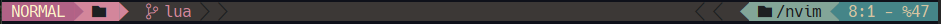
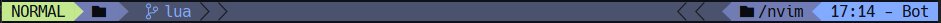
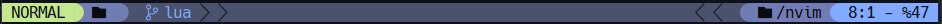
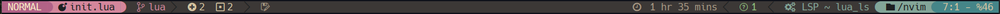

### What is this
This is a simple plugin that I built to display a custom status line in neovim. It is built to accomodate my configs but can be used by anyone who feels like it... however, if you do get it, you should make it work with your own configs. Feel free to fork and modify how you want :-)






### Dependencies

* [plenary.nvim](https://github.com/nvim-lua/plenary.nvim) - for async updates
* [nvim-web-devicons](https://github.com/nvim-tree/nvim-web-devicons)
* a nerd font ([nerd-fonts](https://www.nerdfonts.com/)) - not mandatory... good if you want to display icons and line separators

### Installation

### [lazy.nvim](https://github.com/folke/lazy.nvim)
```lua
{ "ricdotnet/ricdotline" }
```

### Usage
```lua
require("ricdotline").setup {}
```

##### extra setup
```lua
{
  wakatime = true, -- requires wakatime plugin installed
  theme = "gruvbox", -- gruvbox or material
  separator = "arrow", -- arrow or round
  colors = {}, -- to be updated
}
```